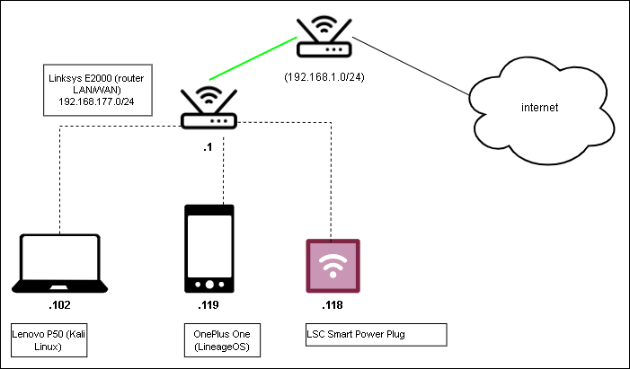
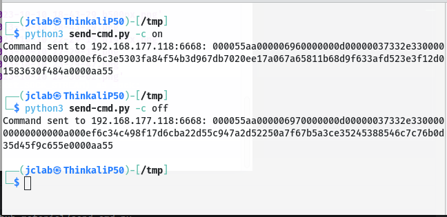
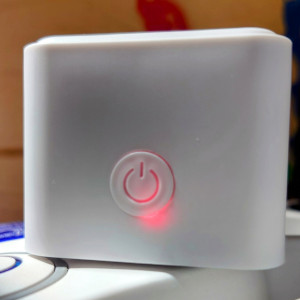

# Hacking Smart Power Plug

[Portuguese version](README.PT.md)

## Objective

The aim is to analyse the possibility of controlling the IoT device without using the APP and Cloud services.

This experiment was motivated by the lessons learned during my participation in a Short Advanced Programme (SAP) on Cyber Security Fundamentals.

The IoT device was purchased in a shop in the Action Shop in Leeuwarden (Netherlands). You can find more information about the product at [action.com/nl](https://www.action.com/nl-nl/p/2578685/lsc-smart-connect-slimme-stekker/)

## Configuration of the laboratory used

### Hardware configuration used in this lab

- Linksys E2000 LAN/WAN router;
- PC (Kali Linux);
- OnePlus One smartphone (LineageOS)
- Smart Power Plug (LSC Smart Connect);

### Software configuration used in this laboratory

- PC (Kali GNU/Linux Rolling, GNOME v44.1, X11, Linux 6.5.0-kali2-amd64):
  - Ettercap v0.8.3.1 (EP);
  - Wireshark v4.0.10;
  - tcpreplay v4.4.4;
  - (option 1) PyCharm Professional v2023.2.2;
  - (option 2) VSCode v1.83.1;
- Smartphone (LineageOS 18.1 Android v11):
  - Tuya Smart v5.5.0(international) App v5.5.0(611) SDK v5.5.0;
  - (\*)LSC Smart Connect v1.1.4(international) App v1.1.4(15) SDK v4.3.0;

(\*) application used in the first test

## Configuring MITM

After connecting all the devices and associating them to the same network as the test lab. The process starts with the Ettercap application to identify all the active devices on the network and then to implement MITM using ARP poisoning. In this test scenario, the smartphone was associated with Target1 and the smart plug with Target2.

## Capturing network packets

Once the network interface has been configured in the Wireshark application, you should start capturing packets. At this point, you use your smartphone to switch the smart plug on and off; this operation can be repeated more than once so that Wireshark captures all the packets in each sequence.

After a few repetitions, the capture is stopped and saved to a file on the disc. This file will be useful for opening, searching and testing various iterations to identify the byte packets for each change of smart plug states.

This test used the packet filtering condition "ip.addr == 192.168.177.118 && tcp.len == 71" because in this scenario the pattern is repeated in direct communications between the smartphone and the smart plug.

## Extract captured information

After identifying the byte packets for each of the states, repeat this operation for each of the states.

Expand the object in the lower panel, position the cursor on "TCP Payload" and right-click. Then choose the options as shown in the following images.

## "Replay attack"

The image shows the result of running the code [send-cmd.py](send-cmd.py)

\*\*IMPORTANT NOTE: the code has the configuration data obtained during tests in my lab, so if you are trying to reproduce this challenge it is important that you make the following changes to the code variables:

- **default_ip_address**: set the IP of your smart plug on your test network;
- **packet_bytes_on** and **packet_bytes_off**: enter the set of bytes extracted from Wireshark for each of the states.

## Behaviour of the smart plug

On

Off

